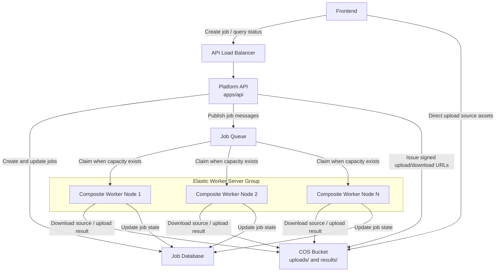
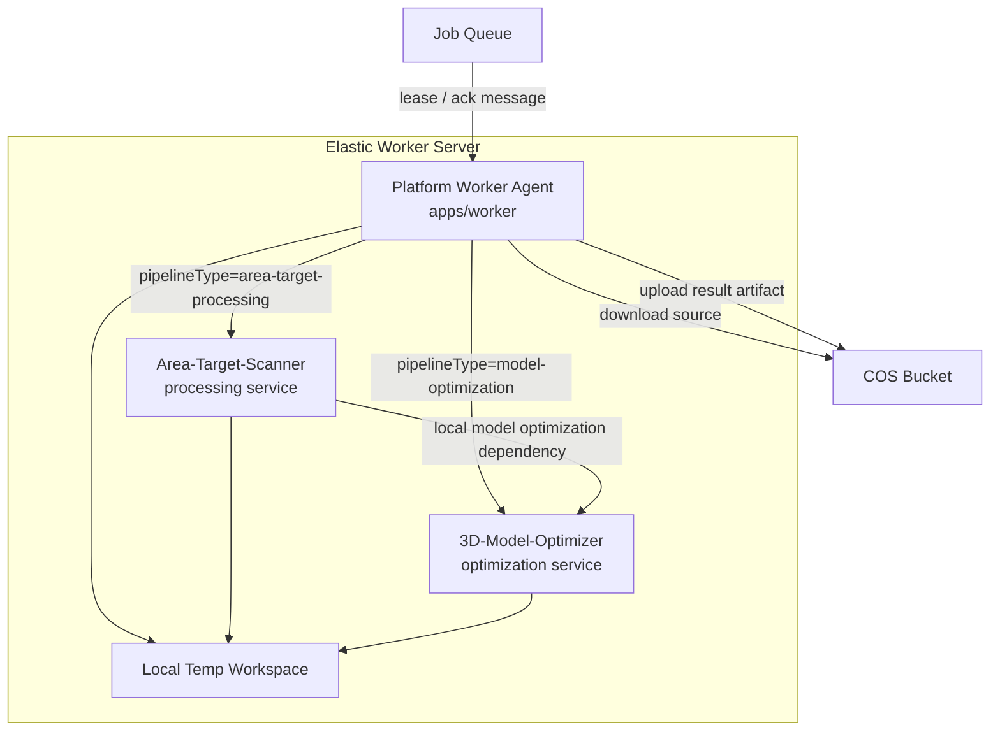
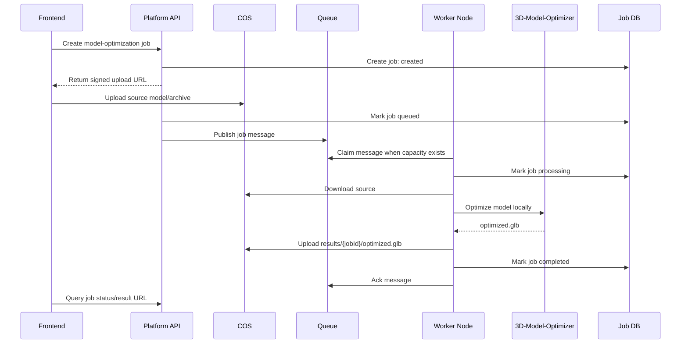
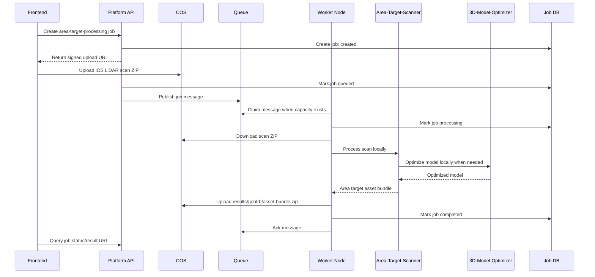

# Deployment Guide

This document explains how the platform, elastic worker servers, 3D-Model-Optimizer, and Area-Target-Scanner should be deployed together.

## Deployment Goal

The platform is split into two layers:

- Control plane: public API, job database, queue, COS bucket, and frontend-facing status endpoints.
- Processing plane: elastic composite worker nodes. Each node can process both `model-optimization` and `area-target-processing` jobs.

The queue is the load balancer. If all worker nodes are busy, jobs remain queued until a node has capacity.

## Production Topology



## Composite Worker Node

Each elastic server should run all local processing dependencies needed by the worker agent.



Recommended first production setting:

```text
WORKER_CONCURRENCY=1
```

One active job per server is safer for the first launch because both Area-Target-Scanner and 3D-Model-Optimizer may use significant CPU, memory, disk, and temporary workspace.

## Job Flow: Model Optimization



## Job Flow: Area Target Processing



## What The Current Repository Deploys

This repository currently contains a scaffold, not the complete production implementation.

| Path | Current role |
| --- | --- |
| `apps/api` | Placeholder API service with `GET /health` and future job route placeholders. |
| `apps/worker` | Placeholder worker process that reads runtime config and stays alive. |
| `packages/shared` | Shared job status and pipeline constants. |
| `infra/docker-compose.yml` | Local development example with API, worker, Redis, MinIO, and 3D-Model-Optimizer. |
| `docs/architecture.md` | Product architecture and composite worker node model. |

Area-Target-Scanner is reserved in the architecture but is not yet wired into `infra/docker-compose.yml`.

## Local Development Deployment

From the repository root:

```bash
docker compose -f infra/docker-compose.yml up --build
```

Local service map:

| Service | URL | Notes |
| --- | --- | --- |
| API | `http://localhost:8080/health` | Scaffold health check. |
| 3D-Model-Optimizer | `http://localhost:3000` | Optimizer sidecar for local development. |
| Redis | `localhost:6379` | Queue placeholder. |
| MinIO API | `http://localhost:9000` | COS-compatible local object storage. |
| MinIO Console | `http://localhost:9001` | Local object storage admin UI. |

## Production Deployment Order

1. Create COS buckets and object key conventions.
2. Deploy the job database.
3. Deploy the queue service with visibility timeout or lease support.
4. Deploy the Platform API behind a public or private load balancer.
5. Build the elastic worker server image or launch template.
6. On each worker server, run the worker agent, Area-Target-Scanner, 3D-Model-Optimizer, and a local temp volume.
7. Configure autoscaling from queue and node metrics.
8. Keep Area-Target-Scanner and 3D-Model-Optimizer private to the worker node network.

## Suggested Object Keys

```text
uploads/{jobId}/source.{ext}
results/{jobId}/optimized.glb
results/{jobId}/asset-bundle.zip
logs/{jobId}/worker.log
```

The API should store the exact source and result keys in the job database. Workers should not infer keys from filenames supplied by users.

## Environment Variables

Platform API:

```text
API_PORT=8080
QUEUE_URL=...
DATABASE_URL=...
COS_BUCKET=...
COS_REGION=...
COS_SECRET_ID=...
COS_SECRET_KEY=...
```

Worker node:

```text
WORKER_CONCURRENCY=1
QUEUE_URL=...
DATABASE_URL=...
COS_BUCKET=...
COS_REGION=...
COS_SECRET_ID=...
COS_SECRET_KEY=...
OPTIMIZER_URL=http://optimizer:3000
AREA_TARGET_SCANNER_URL=http://area-target-scanner:8080
WORKER_TEMP_DIR=/work/temp
```

3D-Model-Optimizer:

```text
PORT=3000
NODE_ENV=production
```

Area-Target-Scanner:

```text
PORT=8080
OPTIMIZER_URL=http://optimizer:3000
WORK_DIR=/work/temp/area-target-scanner
```

## Autoscaling Rules

Scale out when one or more conditions are true:

- total queued jobs exceeds the active worker count
- oldest queued job age exceeds the target wait time
- per-pipeline backlog grows for `model-optimization` or `area-target-processing`
- active nodes are CPU, memory, or disk constrained

Scale in only when:

- the queue is empty or below the idle threshold
- the node has no active job
- the worker has drained and stopped claiming new messages

Do not terminate a node that is processing a job unless the queue lease timeout and retry behavior are known to recover the job safely.

## Network And Security

- Only the Platform API should be reachable from the frontend.
- Worker node services should live on private networking.
- 3D-Model-Optimizer and Area-Target-Scanner should not expose public ports.
- COS credentials should be injected as secrets, not stored in the image.
- Workers should use a per-job temp directory and delete it after completion.
- Queue messages should carry `jobId`, `pipelineType`, source key, output prefix, preset/options, and retry metadata.

## Failure Behavior

If every worker node is busy, jobs remain `queued`.

If a worker crashes, the queue lease expires and another worker can retry the job.

If a pipeline fails, the worker records the error, retry count, and failed stage. Jobs with retry budget remaining move to `retrying`; exhausted jobs move to `failed`.

If COS upload succeeds but database update fails, the worker should retry the database update before acknowledging the queue message. The job result key should be deterministic so duplicate retries remain idempotent.
