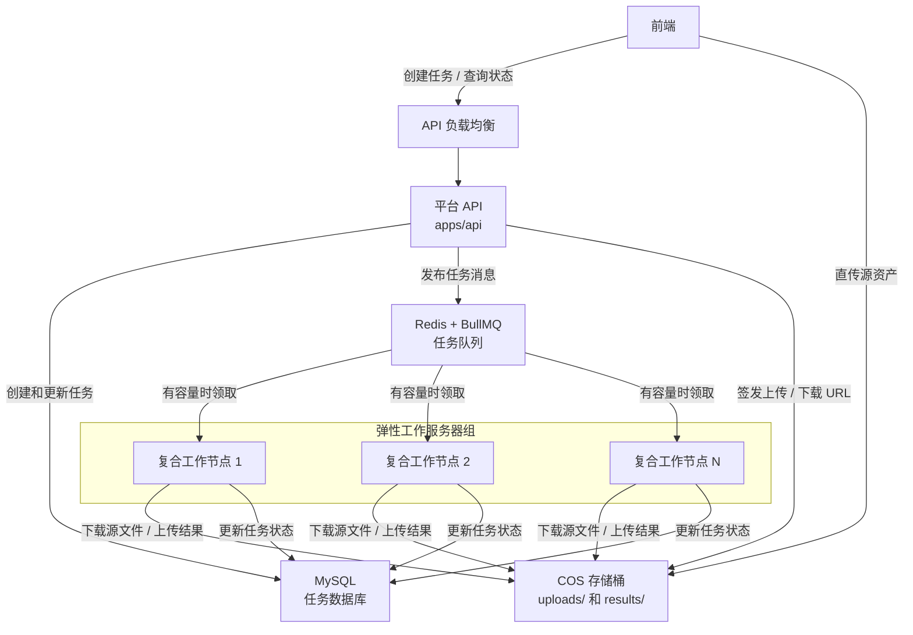
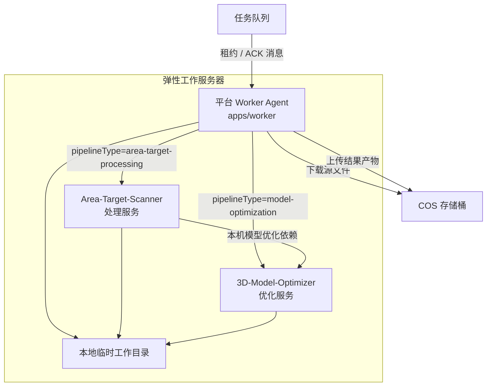
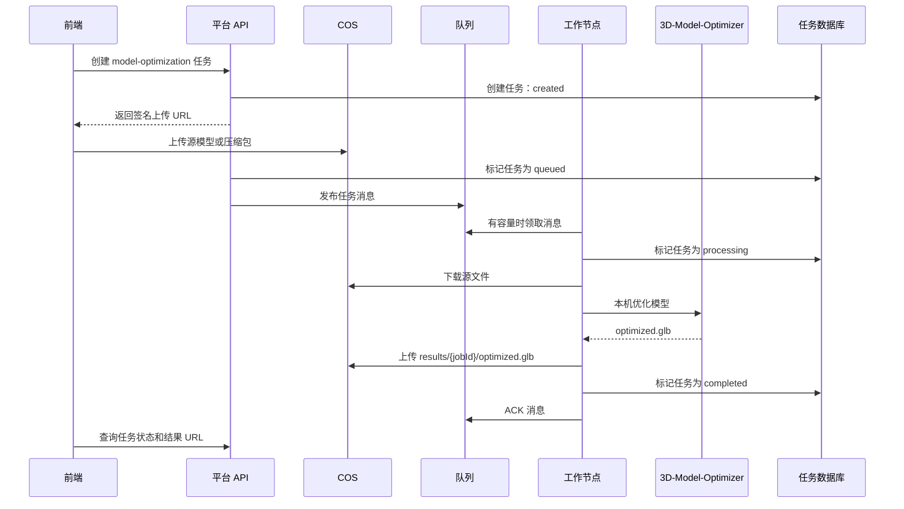
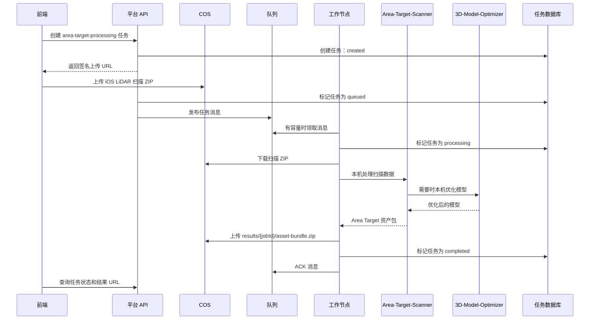

# 部署说明

本文说明平台、MySQL、Redis、弹性工作服务器、3D-Model-Optimizer 和 Area-Target-Scanner 应该如何部署在一起。

## 部署目标

平台分成两层：

- 控制层：对外 API、MySQL 任务数据库、Redis 队列、COS 存储桶，以及前端查询任务状态所需的接口。
- 处理层：弹性的复合工作节点。每个节点都可以处理 `model-optimization` 和 `area-target-processing` 两类任务。

队列就是负载均衡器。如果所有工作节点都在忙，任务继续停留在队列中，直到有节点释放处理能力。

## 生产拓扑



## 复合工作节点

每台弹性服务器都应该运行 worker agent 所需的本地处理依赖。



第一版生产环境建议：

```text
WORKER_CONCURRENCY=1
```

也就是每台服务器同一时间只处理一个重任务。这样更稳，因为 Area-Target-Scanner 和 3D-Model-Optimizer 都可能大量消耗 CPU、内存、磁盘和临时工作空间。

## 任务流：普通模型优化



## 任务流：Area Target 处理



## 当前仓库可以部署什么

当前仓库已经包含第一版 MySQL + Redis/BullMQ 任务主链路。COS 签名和真实 3D-Model-Optimizer 调用仍是占位实现，但任务创建、上传完成入队、worker 领取、MySQL 状态更新和本地 smoke 验证已经可以跑通。

| 路径 | 当前作用 |
| --- | --- |
| `apps/api` | API 服务，提供 `GET /health`、`POST /v1/jobs`、`POST /v1/jobs/{jobId}/complete-upload`、`GET /v1/jobs/{jobId}` 和 `GET /v1/jobs/{jobId}/result-url`。 |
| `apps/worker` | BullMQ worker，消费 `model-processing-jobs` 队列，从 MySQL 读取 job、条件领取并运行 deterministic model optimization wrapper。 |
| `packages/shared` | 共享任务状态和 pipeline 常量。 |
| `infra/docker-compose.yml` | 本地开发示例，包含 API、worker、MySQL、Redis、MinIO 和 3D-Model-Optimizer。 |
| `docs/architecture.md` | 产品架构和复合工作节点模型。 |

Area-Target-Scanner 已在架构中预留，但还没有接入 `infra/docker-compose.yml`。

## 本地开发部署

在仓库根目录执行：

```bash
docker compose -f infra/docker-compose.yml up --build
```

本地服务表：

| 服务 | URL | 说明 |
| --- | --- | --- |
| API | `http://localhost:8080/health` | API 健康检查和任务接口。 |
| 3D-Model-Optimizer | `http://localhost:3000` | 本地开发用优化器 sidecar。 |
| Redis | `localhost:6379` | BullMQ 队列。 |
| MySQL | `localhost:3306` | 任务事实表和状态存储。 |
| MinIO API | `http://localhost:9000` | COS 兼容的本地对象存储。 |
| MinIO Console | `http://localhost:9001` | 本地对象存储管理界面。 |

如果本机已有服务占用默认端口，可以覆盖 host 端口，不影响容器内部连接：

```bash
API_HOST_PORT=8085 REDIS_HOST_PORT=6381 MYSQL_HOST_PORT=3310 \
docker compose -f infra/docker-compose.yml up --build
```

本地 smoke 验证：

```bash
API_HOST_PORT=8085 npm run smoke:mysql-redis
```

第一版 worker wrapper 会写入确定性的 `results/{jobId}/optimized.glb`，真实 COS 下载、优化器调用和结果上传由后续 pipeline 任务替换。

## 生产部署顺序

1. 创建 COS 存储桶，并确定对象 key 规范。
2. 部署 MySQL 任务数据库。
3. 部署 Redis + BullMQ 队列服务。
4. 将 Platform API 部署到公网或内网负载均衡后面。
5. 构建弹性工作服务器镜像或启动模板。
6. 每台工作服务器运行 worker agent、Area-Target-Scanner、3D-Model-Optimizer 和本地临时卷。
7. 根据队列和节点指标配置弹性扩缩容。
8. 保持 Area-Target-Scanner 和 3D-Model-Optimizer 只在工作节点私有网络内可访问。

## 建议的 COS 对象 Key

```text
uploads/{jobId}/source.{ext}
results/{jobId}/optimized.glb
results/{jobId}/asset-bundle.zip
logs/{jobId}/worker.log
```

API 应该把准确的 source key 和 result key 存到任务数据库里。Worker 不应该根据用户上传的原始文件名推断 key。

## 环境变量

Platform API：

```text
API_PORT=8080
API_HOST_PORT=8080
QUEUE_URL=...
DATABASE_URL=...
COS_BUCKET=...
COS_REGION=...
COS_SECRET_ID=...
COS_SECRET_KEY=...
```

Worker 节点：

```text
WORKER_CONCURRENCY=1
QUEUE_URL=...
REDIS_HOST_PORT=6379
DATABASE_URL=...
COS_BUCKET=...
COS_REGION=...
COS_SECRET_ID=...
COS_SECRET_KEY=...
OPTIMIZER_URL=http://optimizer:3000
OPTIMIZER_HOST_PORT=3000
AREA_TARGET_SCANNER_URL=http://area-target-scanner:8080
WORKER_TEMP_DIR=/work/temp
```

3D-Model-Optimizer：

```text
PORT=3000
NODE_ENV=production
```

Area-Target-Scanner：

```text
PORT=8080
OPTIMIZER_URL=http://optimizer:3000
WORK_DIR=/work/temp/area-target-scanner
```

## 弹性扩缩容规则

满足一个或多个条件时扩容：

- 排队任务总数超过活跃 worker 数量。
- 最老排队任务等待时间超过目标等待时间。
- `model-optimization` 或 `area-target-processing` 的单独 backlog 增长。
- 活跃节点出现 CPU、内存或磁盘压力。

只有满足这些条件时才缩容：

- 队列为空，或低于空闲阈值。
- 节点没有正在处理的任务。
- worker 已进入 draining 状态，并停止领取新消息。

不要终止正在处理任务的节点，除非已经确认队列租约超时和重试机制可以安全恢复任务。

## 网络与安全

- 只有 Platform API 应该被前端访问。
- Worker 节点上的处理服务应该运行在私有网络内。
- 3D-Model-Optimizer 和 Area-Target-Scanner 不应该暴露公网端口。
- COS 凭证应该以 secret 注入，不能写进镜像。
- Worker 应该为每个任务创建独立临时目录，并在任务结束后删除。
- 队列消息应包含 `jobId`、`pipelineType`、source key、output prefix、preset/options 和重试元数据。

## 失败处理

如果所有 worker 节点都在忙，任务保持 `queued`。

如果 worker 崩溃，队列租约过期后，其他 worker 可以重试该任务。

如果 pipeline 失败，worker 记录错误、重试次数和失败阶段。仍有重试预算的任务进入 `retrying`；重试耗尽的任务进入 `failed`。

如果 COS 上传成功但数据库更新失败，worker 应该先重试数据库更新，再 ACK 队列消息。结果 key 应保持确定性，这样重复重试仍然是幂等的。
