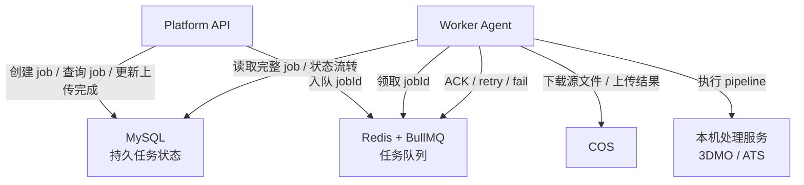
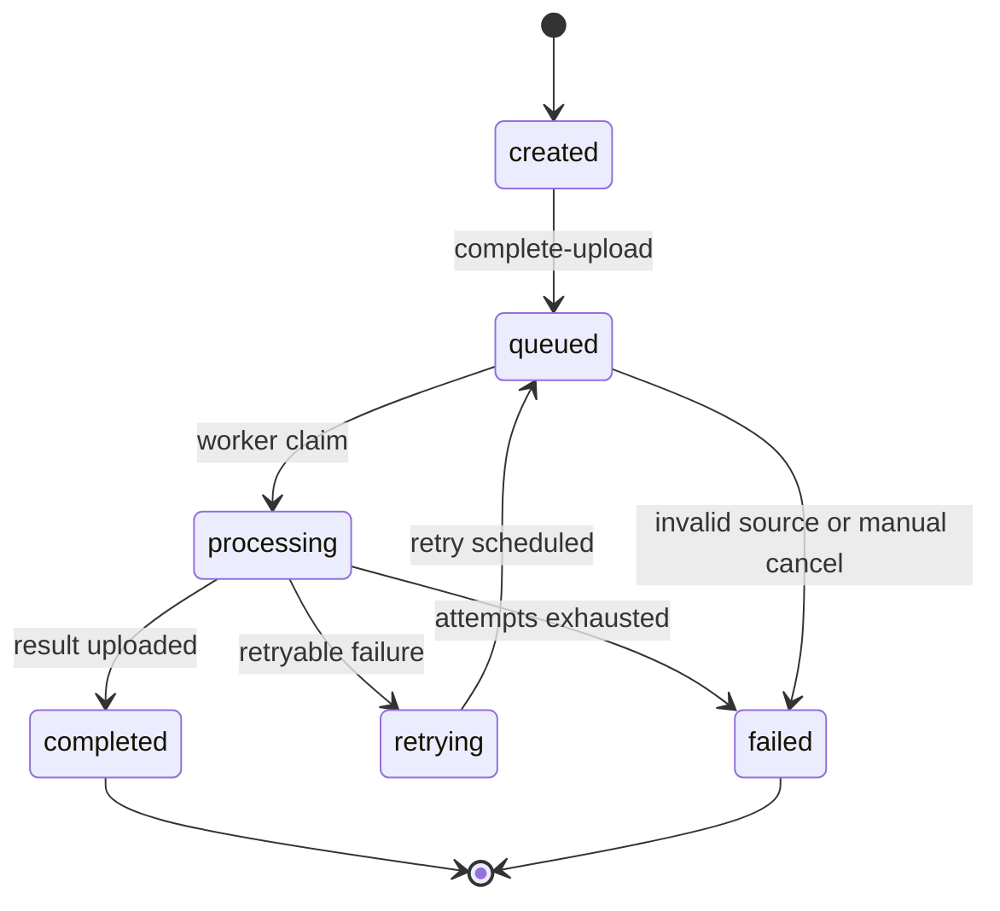

# MySQL + Redis 任务系统设计

本文定义平台第一版使用 MySQL + Redis 的任务持久化和队列方案。

## 结论

第一版使用：

- MySQL：任务事实表、状态、结果、错误、重试次数、审计事件。
- Redis：BullMQ 队列、短期锁、worker 心跳、临时进度缓存。

MySQL 是最终可信来源。Redis 只负责调度和短期运行态，不保存唯一任务事实。

## 数据流



## MySQL 表

`jobs` 是核心表。

```sql
CREATE TABLE jobs (
  id CHAR(36) PRIMARY KEY,
  pipeline_type VARCHAR(64) NOT NULL,
  status VARCHAR(32) NOT NULL,
  source_key VARCHAR(512) NOT NULL,
  result_key VARCHAR(512) NULL,
  artifact_type VARCHAR(64) NULL,
  options_json JSON NULL,
  attempts INT NOT NULL DEFAULT 0,
  max_attempts INT NOT NULL DEFAULT 3,
  error_code VARCHAR(128) NULL,
  error_message TEXT NULL,
  locked_by VARCHAR(128) NULL,
  locked_at DATETIME NULL,
  created_at DATETIME NOT NULL,
  updated_at DATETIME NOT NULL,
  completed_at DATETIME NULL,

  INDEX idx_status_created_at (status, created_at),
  INDEX idx_pipeline_status (pipeline_type, status),
  INDEX idx_locked_at (locked_at)
);
```

建议增加 `job_events` 表保存状态变化和排错信息。

```sql
CREATE TABLE job_events (
  id BIGINT AUTO_INCREMENT PRIMARY KEY,
  job_id CHAR(36) NOT NULL,
  event_type VARCHAR(64) NOT NULL,
  message TEXT NULL,
  metadata_json JSON NULL,
  created_at DATETIME NOT NULL,

  INDEX idx_job_events_job_created (job_id, created_at),
  CONSTRAINT fk_job_events_job
    FOREIGN KEY (job_id) REFERENCES jobs(id)
    ON DELETE CASCADE
);
```

## Redis 队列

第一版使用 BullMQ：

```text
Queue name: model-processing-jobs
```

队列消息尽量短：

```json
{
  "jobId": "uuid",
  "pipelineType": "model-optimization"
}
```

Worker 领取消息后必须去 MySQL 读取完整任务。不要把 `sourceKey`、`resultKey`、`options` 只存在 Redis 消息里。

推荐 BullMQ 参数：

```text
attempts: 3
backoff: exponential
removeOnComplete: 1000
removeOnFail: false
lockDuration: 根据最长任务合理设置，第一版可以从 30 分钟开始
```

## 状态流转



## 幂等性规则

- `result_key` 必须由 `jobId` 决定，例如 `results/{jobId}/optimized.glb`。
- Worker 重试同一任务时覆盖同一个结果 key，或先检查结果是否已存在。
- Worker 设置 `processing` 时用条件更新，避免两个 worker 同时处理同一个 job。
- Redis 消息重复投递时，MySQL 状态决定是否继续处理。
- COS 上传成功但 MySQL 更新失败时，worker 先重试 MySQL 更新，再 ACK 队列消息。

## Worker 领取任务规则

Worker 收到 Redis 消息后执行：

1. 从 MySQL 查询 job。
2. 如果 job 已经是 `completed` 或 `failed`，直接 ACK。
3. 如果 job 不是 `queued` 或 `retrying`，记录事件后 ACK。
4. 使用条件更新把 job 改为 `processing`：

```sql
UPDATE jobs
SET status = 'processing',
    attempts = attempts + 1,
    locked_by = ?,
    locked_at = NOW(),
    updated_at = NOW()
WHERE id = ?
  AND status IN ('queued', 'retrying')
  AND attempts < max_attempts;
```

只有受影响行数为 `1` 的 worker 可以继续处理任务。

## API 与 Redis 的关系

API 创建任务时只写 MySQL，不直接入队：

```text
POST /v1/jobs
-> MySQL: created
-> return signed upload URL
```

前端上传完成后通知 API：

```text
POST /v1/jobs/{jobId}/complete-upload
-> MySQL: queued
-> Redis: add { jobId, pipelineType }
```

这样可以避免源文件还没上传完，worker 就开始处理。

## 运维指标

必须采集：

- MySQL 中 `queued` 数量。
- MySQL 中最老 `queued` 等待时间。
- Redis queue waiting / active / failed 数量。
- Worker active job 数量。
- 每个 pipeline 的平均耗时和失败率。
- MySQL 慢查询。
- Redis 连接数和内存。

扩容优先看 MySQL/Redis 中的 backlog 和最老等待时间，而不是 API QPS。
